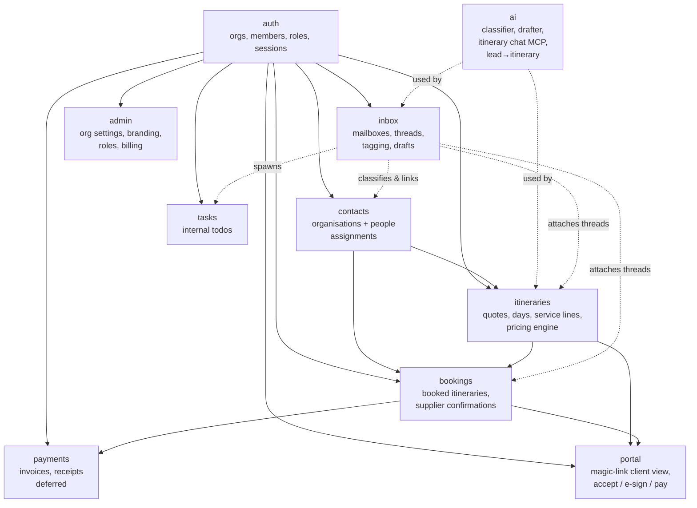

# System Spec — Part 1: Foundations

> **Series index** — comprehensive v1 specification for the DMC SaaS platform.
> Each part is self-contained but cross-references the others.
>
> 1. **Foundations** _(this file)_ — purpose, personas, glossary, tenancy, feature map
> 2. [Contacts, Sales Pipeline, Pricing Engine](./specs-part-2.md)
> 3. [Communication & AI](./specs-part-3.md)
> 4. [Operations & Surfaces](./specs-part-4.md)
> 5. [Platform](./specs-part-5.md)
>
> Cross-cutting technical decisions live in the [ADRs](../README.md). This series describes _what the system does_; ADRs describe _how we build it_.

## Purpose

A SaaS platform for **Destination Management Companies (DMCs)** — local specialists who design, sell, and operate travel experiences in a destination on behalf of travel agents (B2B) or directly to travelers (B2C).

The platform is operations-first. It is the daily tool a DMC's team uses to:

- Receive and triage inbound enquiries (mostly email).
- Build, price, and quote multi-day itineraries.
- Convert accepted quotes into bookings with suppliers.
- Track who is responsible for what and what is happening when.
- Maintain a long-term, queryable history of every client, supplier, and trip.

The platform is **CRM-first** — the system of record for client and supplier relationships, with quoting and operations layered on top.

## Personas

| Persona                     | What they do in the system                                                                                                                                     |
| --------------------------- | -------------------------------------------------------------------------------------------------------------------------------------------------------------- |
| **Operations**              | Reads inbound mail, builds itineraries, places bookings with suppliers, attaches documents, manages the day-by-day flow of confirmed trips.                    |
| **Sales / account manager** | Owns a client relationship (often shared with one or more colleagues), drafts quotes, negotiates with the client, closes the deal.                             |
| **Finance**                 | Issues invoices, reconciles client receipts, schedules supplier payouts. _(Operational payments deferred to a later release; finance role planned around it.)_ |
| **Admin**                   | Manages the org's settings, members, roles, connected mailboxes, branding, billing.                                                                            |
| **Client (B2B agent)**      | Receives quotes; reviews and accepts via the magic-link portal. Doesn't have a logged-in account in v1.                                                        |
| **Client (B2C traveler)**   | Same as B2B agent from the system's point of view — receives a quote link, accepts, pays deposit, eventually receives final docs.                              |

Roles are **customizable per org** (see [Part 4](./specs-part-4.md#roles--permissions)) — these personas describe the typical shape of work, not hardcoded role names.

## Domain glossary

| Term                                | Meaning                                                                                                                              |
| ----------------------------------- | ------------------------------------------------------------------------------------------------------------------------------------ |
| **DMC**                             | The customer of this platform — a company selling local travel services in a destination.                                            |
| **Org**                             | A DMC's tenant in the platform. Hard isolation boundary; every row belongs to exactly one org.                                       |
| **Member**                          | A user belonging to an org (ops, sales, finance, admin).                                                                             |
| **Organisation** _(contact entity)_ | A company in the contacts directory. Has a `kind`: **`client_agency`** (B2B agency) or **`supplier`** (vendor).                      |
| **Person**                          | A human in the contacts directory. Optionally belongs to an organisation. B2C clients are people without an organisation.            |
| **Client**                          | A contact (organisation or person) the DMC sells to. Either B2B (agency + agents) or B2C (direct traveler).                          |
| **Supplier**                        | A contact the DMC books from: hotels, transport, guides, restaurants, activity providers, and so on.                                 |
| **Lead**                            | An incoming enquiry, before it has been quoted. Originates from inbound email, web form, or manual entry.                            |
| **Quote**                           | A proposed itinerary with pricing, sent to a client for acceptance. Mutable until accepted.                                          |
| **Itinerary**                       | The structured product: days × services. The same record progresses from lead-stage draft → quote → booked itinerary.                |
| **Booking**                         | The state an itinerary enters when the client accepts. From this point the data is operational: confirmations, vouchers, payments.   |
| **Service item**                    | A bookable unit offered by a supplier (a hotel room, a guided tour, a transfer). Carries pricing rules.                              |
| **Service line**                    | A specific service item placed on a specific day of an itinerary, with quantity, pax, dates, and computed price.                     |
| **Mailbox**                         | An external email account (Gmail / Microsoft) connected to an org via the mailbox provider.                                          |
| **Thread**                          | An email conversation, mirrored from a connected mailbox.                                                                            |
| **Assignment**                      | The link between a contact and one or more sales people, with split percentages. Snapshotted onto bookings for sales-credit history. |

## Multi-tenancy

- **Per-org isolation.** Every row in the system carries an `org_id`. Cross-org reads are prevented at the API layer (queries always scope by the request's org).
- **No row-level security at the database.** Application-level enforcement keeps queries simple and traces readable. Per [ADR-0006](../adr/0006-error-handling.md), permission failures use `error(403, …)` with a stable `code`.
- **Soft delete on contacts and itineraries.** Hard delete is reserved for GDPR erasure flow ([Part 5](./specs-part-5.md#compliance--data)).
- **Audit trail.** Every mutation on key entities (contacts, itineraries, bookings, assignments, payments) records who/when/before→after. Retained indefinitely (this is a CRM).

## Feature map

The platform is organised as feature modules under `src/lib/features/` (see [ADR-0002](../adr/0002-feature-based-architecture.md)). Each feature owns its data, business logic, and UI; cross-feature dependencies go through public APIs only.

**Dependency direction.** Lower features (`auth`, `contacts`) don't know about higher ones. Higher features import lower features only via their public APIs (`$features/<name>`, `$features/<name>/server`, `$features/<name>/remote`).

**`ai` is a horizontal capability.** Inbox uses it for classification and reply drafting; itineraries use it for chat-driven editing (via MCP tools) and lead→itinerary generation. Cost ceiling and tool-call audit live in the `ai` feature itself ([Part 3](./specs-part-3.md#ai-assistant)).

**`portal` is a separate feature.** Client-facing magic-link surfaces are isolated from the authenticated app — different routes, different layout, different auth model (a signed token rather than a session).

### Current vs intended state

- Currently in the codebase: `auth`, `admin`.
- Everything else on the map is **intended scope**, built incrementally. The architecture supports adding features as folder-level additions without restructuring.
- Adding a new feature means: place it on this map, give it the three required entry points (`index.ts`, `server/index.ts`, `remote/index.ts`), and update this document in the same PR.

## How to read this series

- **Foundations** _(this file)_ — orient yourself: who, what, where things live.
- **[Part 2](./specs-part-2.md)** — the **product**: contacts, sales pipeline, pricing engine.
- **[Part 3](./specs-part-3.md)** — the **AI-augmented inbox**.
- **[Part 4](./specs-part-4.md)** — the **operational surfaces**: attribution, tasks, documents, portal, notifications, permissions.
- **[Part 5](./specs-part-5.md)** — the **platform**: integrations, entity model, end-to-end workflow, subscription, compliance, observability.

When something needs to change, update the relevant part in the same PR as the code. The spec series is allowed to drift no more than one release behind reality.
