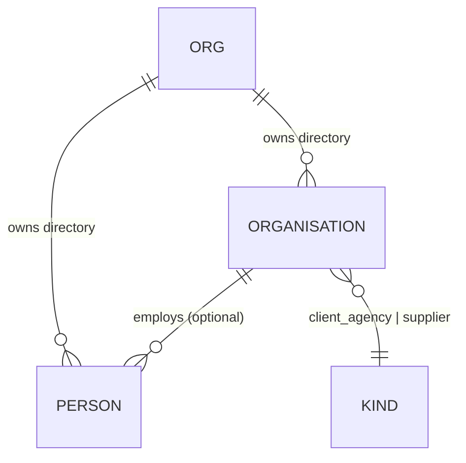
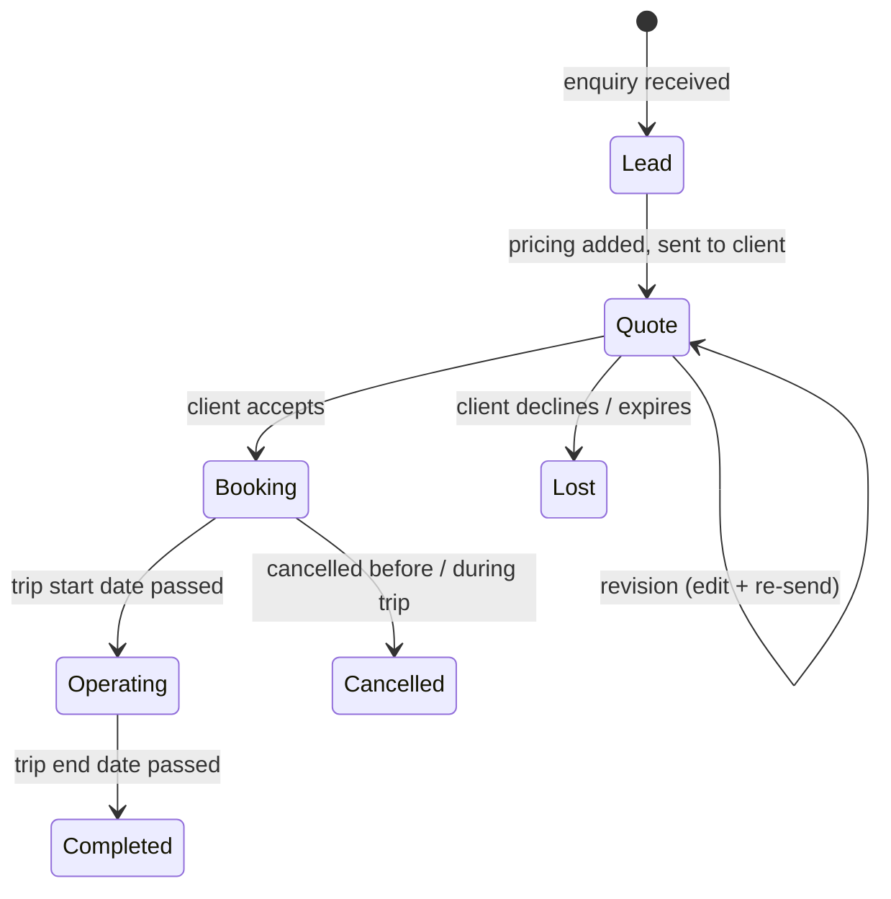

# System Spec — Part 2: Contacts, Sales Pipeline, Pricing Engine

> Series: [1. Foundations](./specs-part-1.md) · **2. Contacts, Pipeline, Pricing** _(this file)_ · [3. Communication & AI](./specs-part-3.md) · [4. Operations & Surfaces](./specs-part-4.md) · [5. Platform](./specs-part-5.md)

This part defines the **product**: who the DMC is selling to and buying from (**contacts**), how a deal moves from interest to commitment (**sales pipeline**), and how money is computed at every step (**pricing engine**).

## Contacts

A single contacts directory serves both **clients** (who buy) and **suppliers** (who sell to the DMC). Two entity types.

### Organisation

A company. Carries a `kind`:

- **`client_agency`** — a B2B travel agency that resells the DMC's product (e.g. _Acme Travel_).
- **`supplier`** — a vendor the DMC books from (e.g. _Hotel Mare_, _Bella Tours_).

Plus org metadata: name, country, default currency for billing, default language, address, tax id, internal notes, tags. Carries a directory of **rate sheets** when the kind is `supplier` (see Pricing engine below).

### Person

A human. Optionally belongs to an organisation:

- **B2B clients** are people inside a `client_agency` (Anna and Ben at Acme Travel).
- **Suppliers** have multiple people for different purposes (reservations, accounts, ops manager).
- **B2C clients** are standalone people with no organisation.

Person fields: name, email(s), phone, role/title, language preference, notes. PII fields (passport, DOB, dietary, mobility, allergies) are captured per-trip, not on the person record by default.



### Pricing & assignment attached to contacts

Two cross-cutting concerns live on contacts:

- **Per-client pricing rules** — line-item-level overrides applied when this client is the buyer. Detailed in the Pricing engine section below.
- **Sales assignments** — the team of sales people responsible for the relationship, with split percentages. Detailed in [Part 4: Sales attribution](./specs-part-4.md#sales-attribution).

## Sales pipeline

A single record (the **itinerary**) flows through the lifecycle. State, not separate tables, distinguishes lead from quote from booking.



### Stages

- **Lead** — itinerary in early state. Contacts captured; service lines may be empty or sketched. Often arrives via the inbox (AI tags an inbound email as `client_inquiry` and seeds a lead).
- **Quote** — itinerary has pricing and is shareable with the client. The client receives a magic-link URL ([Part 4: Client portal](./specs-part-4.md#client-portal)) with a richer view than the PDF, plus an attached quote PDF for download.
- **Booking** — client accepted via the portal. The itinerary's pricing is locked into a snapshot; subsequent edits create a revision rather than mutating the accepted version.
- **Operating** / **Completed** / **Cancelled** — operational lifecycle states; mostly informational, with hooks for ops dashboards (deferred).

### Revisions

Quotes are mutable — sales edits and re-sends freely. **Acceptance creates an immutable snapshot** of the priced itinerary at that moment (the `booking_snapshot`). Further edits to the itinerary after booking create a new revision row; the snapshot tied to the original acceptance never changes.

### Lifecycle timestamps

Captured on the itinerary record, regardless of v1 reporting plans:

- `leadCreatedAt`
- `firstQuoteSentAt`
- `acceptedAt` (= `bookedAt`)
- `tripStartAt`, `tripEndAt`
- `cancelledAt` (nullable)

These power future analytics (closing time, booking window, conversion rate) without retro-instrumentation.

## Pricing engine

Two-layer model: **per service line** and **per quote**.

### Service items vs service lines

- A **service item** is a catalogue entry on a supplier (a hotel room category, a guided tour, a private transfer). It carries pricing **rules**, not absolute prices: rate source, seasonality, supplements.
- A **service line** is a service item placed onto a specific day of an itinerary, with quantity, pax, dates. The pricing engine resolves the line's price by evaluating the item's rules against the line's context.

### Rate sources

Each service item declares one rate source:

| Source    | Behaviour                                                                                                                  |
| --------- | -------------------------------------------------------------------------------------------------------------------------- |
| `stored`  | Structured rates in the system, entered by the DMC: `{ amount, currency, validity, ... }` indexed by RRULE-driven seasons. |
| `dynamic` | Real-time fetch from a supplier API (hotel chain, aggregator). Cached per quote; refreshed on demand.                      |
| `manual`  | No stored or dynamic rate; the system flags the line and requires a sales-person to type a price.                          |

If `stored` returns no match for a given date / pax (e.g. an unconfigured season), the engine falls back to `manual` for that line and surfaces a banner: _"Rate missing — please enter manually."_ Sales is never blocked.

### Per-line model

Each service line carries:

| Field                  | Purpose                                                                                               |
| ---------------------- | ----------------------------------------------------------------------------------------------------- |
| `pricing_unit`         | One of `per_room_per_night`, `per_pax`, `per_group`, `per_vehicle`, `per_day`. Drives multiplication. |
| `cost` (internal)      | What the DMC pays the supplier per unit. Always visible to sales.                                     |
| `sale` (client-facing) | What the client is charged per unit. Editable by sales.                                               |
| `margin` (computed)    | `sale − cost`. Live, displayed beside `sale` as the user edits.                                       |
| `supplements[]`        | List of `{ kind, amount }` add-ons: single, extra-bed, child, sea-view, etc.                          |
| `inclusions`           | Free-text "what's included" (breakfast, taxes, …). Surfaces on quote and voucher.                     |
| `exclusions`           | Free-text "what's not" (minibar, spa, …).                                                             |
| `qty`, `pax`, `nights` | Multipliers picked up by `pricing_unit` math.                                                         |
| `history[]`            | Append-only audit of price changes: `{ at, by, before, after, reason? }`.                             |

**Cost engine math** (per line):

```
unit_total = sale × multiplier(pricing_unit)
           + Σ supplements applicable to this booking
```

Where `multiplier`:

- `per_room_per_night` → `qty × nights`
- `per_pax` → `pax`
- `per_group` → `1`
- `per_vehicle` → `qty`
- `per_day` → `nights` (or `qty` for non-accommodation day-rates)

**Optional org-level margin floor.** Org admins may set a `minMarginPercent`. When a sales line dips below it, the system **warns** by default; configurable to **block** save.

### Per-quote model

Aggregates lines and applies quote-level concerns:

- **FX snapshot.** When the quote is first sent, the engine snapshots the exchange rate from each supplier-currency to the **quote currency**. The snapshot is stored on the quote (`fx_snapshot: { 'EUR→USD': 1.083, 'JPY→USD': 0.0067, ... }`) and used for every subsequent calculation until the quote is re-costed. Without this, daily FX drift would silently change the client's quoted total.
- **Refresh action.** Sales can explicitly re-fetch dynamic rates and FX, see a side-by-side diff, then accept or revert. _(Deferred: dedicated re-cost UI; v1 ships the snapshot mechanism without the diff view.)_
- **Display mode.** Per-quote setting: `itemized` (every line shown), `daily` (one total per day), `package` (single grand total). Same data, different presentation. Default is `itemized`.

### Multi-currency

- Org has a single **`baseCurrency`** — the currency in which payments are processed. Reports and aggregates roll up to base.
- A quote may be issued in any of the org's enabled currencies (`USD`, `EUR`, `GBP`, `JPY`, `AUD`, `CAD`, etc.). FX from supplier-currency to quote-currency is locked by the FX snapshot above. FX from quote-currency to org base happens at payment time when payments lands.
- **FX provider** is pluggable (Fixer / OpenExchangeRates / ECB feed are all viable). Decided at implementation time.

### Seasonality

Stored rates use **RRULE (RFC 5545)** to express recurrence. Examples:

- `FREQ=YEARLY;BYMONTH=6,7,8` — high season every June–August.
- `FREQ=YEARLY;BYMONTH=12;BYMONTHDAY=20,21,22,23,24,25,26,27,28,29,30,31` — Christmas peak.
- `FREQ=WEEKLY;BYDAY=FR,SA` — weekend supplement.

Rate lookup picks the **most specific matching season** for the requested date; otherwise falls back to a base rate, and ultimately to manual entry.

### GIT (group travel)

For groups, two extra mechanisms apply:

- **Tiered per-pax pricing.** A service item may declare bands: `1–10 pax = X`, `11–20 = Y`, `21+ = Z`. The engine picks the band based on the booking's pax count and applies it to all `per_pax` lines that opt-in.
- **Free-of-charge (FOC) policy.** Per service item: `1 FOC per N paying`. The engine excludes the FOC count from `per_pax` line totals. Industry-standard for tour leaders / group escorts.

Both are off by default; enabled per service item where group pricing makes sense (typically activities, meals, guided tours; rarely accommodation).

### Worked example (single FIT, one currency)

- 4-night trip, 2 pax, 1 room.
- Hotel @ EUR 200/room/night × 4 nights = **EUR 800**.
- Single supplement N/A (2 pax in 1 room).
- Private transfer (per_vehicle) @ EUR 80 × 1 = **EUR 80**.
- Guided day tour (per_pax) @ EUR 60 × 2 = **EUR 120**.
- **Subtotal sale: EUR 1,000**. Margin shown live as the difference between each line's `cost` and `sale`.

Display mode `daily` would group these by their `dayIndex`. Display mode `package` would show a single _"Trip package: EUR 1,000"_.

## Deferred / out of scope for v1

- **Tax / VAT.** Reserve `tax_inclusive: boolean` and a `tax_lines[]` shape on lines for later. EU VAT, US sales tax, and accommodation-specific reduced rates require a dedicated pass.
- **Re-cost UI.** The FX snapshot mechanism ships in v1; the side-by-side diff view of "rates have moved, here's what changed" comes later.
- **Fixed-package override mode.** Setting a target headline price and back-solving multipliers across non-accommodation lines. Useful for marketing-led packages; deferred.
- **Marketing "from" prices.** `priceFrom: { pax2, pax4 }` for catalogue display. Deferred.
- **Per-line P&L tracking** (`paid` field). Schema reserved; populated when payments lands.

## Cross-references

- **Sales attribution on the booked itinerary** → [Part 4](./specs-part-4.md#sales-attribution).
- **Quote PDF, online quote view, invoice generation** → [Part 4](./specs-part-4.md#documents).
- **Client portal acceptance flow** → [Part 4](./specs-part-4.md#client-portal).
- **AI-assisted lead → itinerary generation, AI chat to edit pricing** → [Part 3](./specs-part-3.md#ai-assistant).
- **Entity diagram showing all of this in context** → [Part 5](./specs-part-5.md#entity-model).
