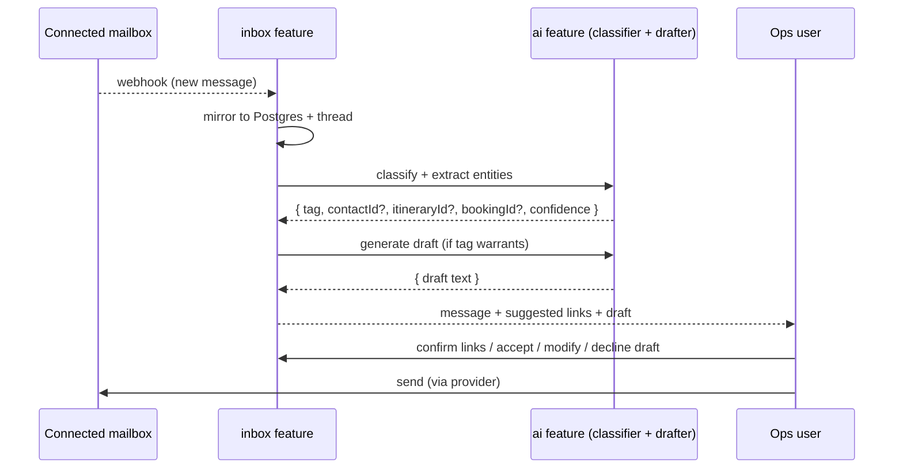

# System Spec — Part 3: Communication & AI

> Series: [1. Foundations](./specs-part-1.md) · [2. Contacts, Pipeline, Pricing](./specs-part-2.md) · **3. Communication & AI** _(this file)_ · [4. Operations & Surfaces](./specs-part-4.md) · [5. Platform](./specs-part-5.md)

Email is the operational substrate of a DMC. Every lead, every supplier confirmation, every modification arrives or leaves as a message. This part describes the **inbox** (connected mailboxes, mirroring, threading) and the **AI capabilities** layered on top (classification, draft generation, itinerary chat, lead → itinerary).

## Inbox

### Connected mailboxes

- An org connects one or more **mailboxes** — typically `ops@dmc.com`, `bookings@dmc.com`, `accounts@dmc.com` — via OAuth through the **mailbox provider** (Nylas in v1; abstraction allows swap, see [Part 5: Integrations](./specs-part-5.md#external-integrations)).
- Multiple mailboxes per org are first-class. Permissions can scope access (e.g. only finance sees `accounts@`); see [Part 4: Roles & permissions](./specs-part-4.md#roles--permissions).
- Connection lifecycle: connect (OAuth flow), pause (suspend sync without losing data), disconnect (revoke + retain mirrored history).

### Mirror to Postgres

- Inbound and outbound messages are mirrored into our database as the **system of record**. The mailbox provider is the source of the wire; Postgres is the source of truth for everything we layer on (tags, links, drafts, decisions).
- Mirroring is **webhook-driven** for new traffic; a bounded backfill (default last 30 days) runs on first connect to seed history. Larger backfills are explicit user action.
- Attachments are stored in R2; we keep the metadata + a fetched copy.
- Threading uses the provider's thread id as the canonical grouping. We additionally allow **conversations** — our own grouping that may span multiple provider threads about the same booking (e.g. an email chain that splinters when forwarded).

### Per-thread state

Every thread carries:

- **Tags** — AI-generated and human-editable (see _AI tagging_ below).
- **Soft links** — optional references to a contact, an itinerary, a booking. Set by AI extraction; correctable by humans. Wrong links don't break the schema.
- **Internal notes** — comments visible to org members, never sent in email. Used for handover, context, decisions.
- **Read/unread, star, archive** — per-user state for the standard inbox UX.
- **Assignment** — a thread can be owned by one team member, with explicit handover. Reuses the assignment model from contacts (see [Part 4](./specs-part-4.md#sales-attribution)).

### Compose, reply, forward

- Reply, reply-all, forward, and compose-new (cold outreach) are all supported.
- Outbound goes through the connected mailbox so the client sees ordinary email continuity (DKIM/SPF on the DMC's domain, not ours).
- **Per-user signatures**, optionally overridden **per mailbox**. Resolved at compose time.
- **Templates / canned responses** — saved snippets a team can drop in. Org-scoped.
- **Drafts saved automatically** as the user types. Always recoverable.

### Search

Global search across threads + contacts + itineraries + bookings. v1 indexes subject, body, contact name, contact email, itinerary title; full-text over message bodies. Filters: tag, mailbox, contact, date range, has-attachment, unread.

### Sensible defaults — call out

A handful of inbox concerns weren't deeply specified during discovery; v1 ships with these defaults, **changeable later**:

- Templates: yes, simple text snippets.
- Internal notes: yes, per-thread comment thread.
- Per-user + per-mailbox signatures.
- Standard read/unread/star/archive.
- Thread assignment with explicit handover.

If any of these need to be reshaped, change in a follow-up spec revision.

## AI

The `ai` feature is a **horizontal capability** consumed by other features — primarily `inbox` and `itineraries`. It owns:

- The model adapter (Anthropic Claude in v1; provider swappable).
- Prompts, tool definitions, and the agent runner.
- Per-org cost ceiling.
- Tool-call audit log.
- Streaming output infrastructure.

### Inbox AI

Three jobs run on or near every inbound message.

**Classification.** A small, fast prompt (Haiku-class model) tags the message with one of:

`client_inquiry`, `client_modification`, `client_acceptance`, `client_payment`, `client_followup`, `supplier_confirmation`, `supplier_availability`, `supplier_change`, `supplier_invoice`, `internal`, `spam`, `unclassified`.

The taxonomy is deliberately small. Humans can re-tag freely; corrections are not used to retrain in v1 but are logged for later evaluation.

**Entity extraction.** The same prompt extracts likely links: `contactId?`, `itineraryId?`, `bookingId?`, each with a confidence score. The UI shows _suggested_ links; the user confirms with one click.

**Draft generation.** For tags where a reply is meaningful (`client_inquiry`, `supplier_availability`, `supplier_change`, …), a Sonnet-class model produces a draft reply using the thread + linked entities as context. The draft surfaces in the message view; the user **accepts**, **modifies**, or **declines**. Drafts are **never auto-sent**.

### AI assistant

Beyond per-message inbox work, the assistant supports interactive tasks:

- **Itinerary chat (MCP).** Sales opens a chat panel on an itinerary and instructs the assistant in natural language: _"swap the Amalfi hotel for a beachfront option around the same price", "add a half-day cooking class on day 4"_. The assistant calls **MCP tools** that mutate the itinerary (search supplier services, add/remove/replace lines, recompute pricing). Every tool call is logged.
- **Lead → itinerary generation.** Given an inbound enquiry's free text ("9-day honeymoon, Rome and Amalfi, mid-budget, July"), the assistant drafts a starter itinerary using the contacts directory, supplier catalogue, and rate sheets. Sales reviews and edits.
- **Thread summarization.** For long supplier negotiations or returning-client history, a "summarise this thread" / "summarise this contact" action.
- **Translation.** Inbound messages from suppliers in other languages can be translated on demand to the user's language. Outbound drafts can be translated on send.
- **Supplier suggestions.** Given a service requirement (date, city, type, budget), the assistant proposes suppliers from the directory based on past usage and matching criteria.

### MCP tools (itinerary chat)

The MCP tool surface for itinerary chat is the same set the UI exposes — no special privileges. Examples (final list lives with the implementation):

- `itinerary.addLine`, `itinerary.removeLine`, `itinerary.updateLine`
- `itinerary.replaceSupplierService`
- `itinerary.recomputePricing`
- `supplier.search`, `supplier.getRateSheet`
- `contact.find`

A tool call is a normal mutation, subject to the same permissions as a UI action by the same user. The user is the principal; the assistant is acting as a delegate.

### Tool-call audit log

Every tool call the AI makes records: `at`, `byUserId` (the principal), `tool`, `arguments`, `result`, `entityIds[]` (what was touched). Visible in the entity's audit trail alongside human edits, marked clearly as AI-originated. This is non-negotiable — users need to know what the AI did and on whose behalf.

### Cost ceiling

Each org has an admin-configurable monthly **AI spend cap**. The `ai` feature tracks token usage per call, attributes to the org, and:

- **Soft cap**: warning banner at 80%.
- **Hard cap**: block further AI requests until the next period or an admin lifts it.

Per-call cost depends on the job:

- Classification (Haiku-class): cheap, runs on every inbound message.
- Drafting (Sonnet-class): moderate, runs on selected inbound + on user request.
- Itinerary chat (Sonnet-class with tool calling, multiple turns): the highest-cost path; subject to per-conversation token budget.
- Lead → itinerary generation: moderate to high; one-shot per lead with explicit user trigger.

### Provider abstraction

The AI provider is hidden behind an adapter (per [ADR-0003](../adr/0003-service-layer-pure-logic-thin-io.md)). v1 uses Anthropic Claude. Swapping providers means writing a new adapter; prompts and tool definitions are portable.

## What this feature does NOT do

- **Auto-reply without human review.** Every outbound is human-confirmed. Travel is high-stakes; wrong details cost money.
- **Auto-create bookings from email.** Tag + link + draft is the limit. Creating a booking is always a human action (often informed by the AI's draft).
- **Train on customer data.** v1 has no fine-tuning loop. Prompts + retrieval only.
- **Speak as a different account manager's persona.** Voice cloning per user is out of scope; signatures and templates handle the personalisation that matters.

## Cross-references

- **Inbox tags driving task creation** → [Part 4: Tasks](./specs-part-4.md#tasks).
- **Thread assignment / handover** → [Part 4: Sales attribution](./specs-part-4.md#sales-attribution).
- **Mailbox-provider adapter shape** → [Part 5: Integrations](./specs-part-5.md#external-integrations).
- **End-to-end workflow showing inbox + AI in context** → [Part 5: End-to-end workflow](./specs-part-5.md#end-to-end-workflow).
