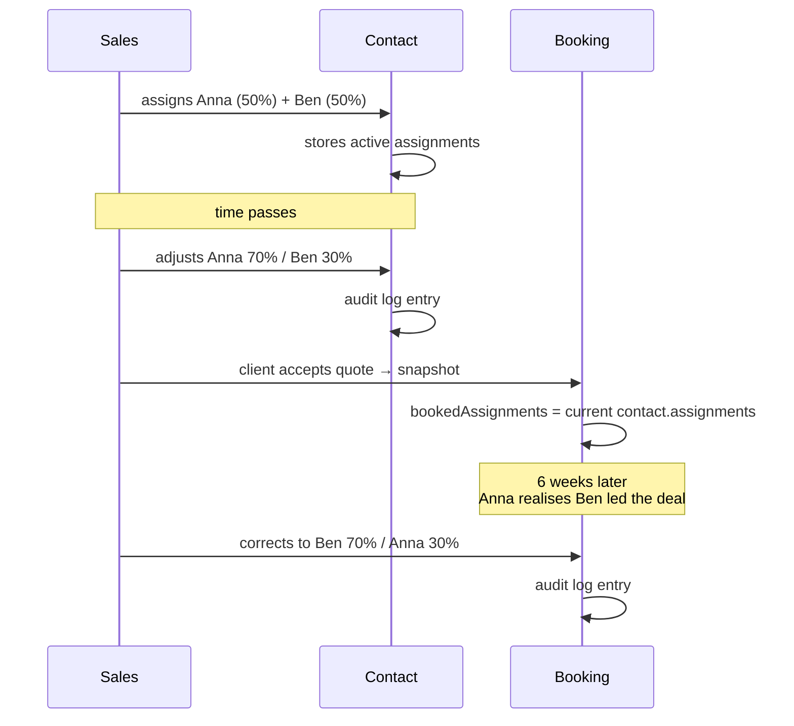
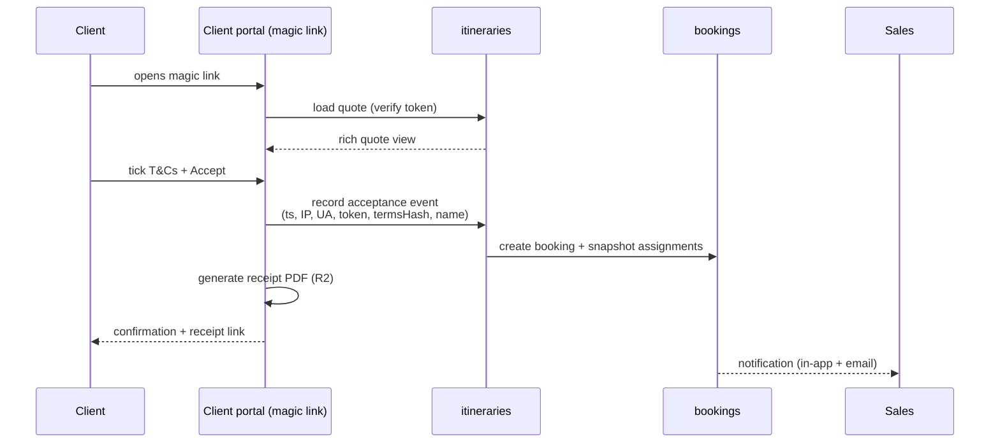

# System Spec — Part 4: Operations & Surfaces

> Series: [1. Foundations](./specs-part-1.md) · [2. Contacts, Pipeline, Pricing](./specs-part-2.md) · [3. Communication & AI](./specs-part-3.md) · **4. Operations & Surfaces** _(this file)_ · [5. Platform](./specs-part-5.md)

This part covers the operational scaffolding around the product: who gets credit (**sales attribution**), what to do next (**tasks**), what the client sees (**documents** + **portal**), how people are notified (**notifications**), and who can do what (**roles & permissions**).

## Sales attribution

A contact is owned by **one or more sales people**, with split percentages. When the deal closes, the team and split at that moment are snapshotted onto the booking so future re-assignments don't rewrite history. The system **captures the data**; managers use it to decide payouts externally — bonus payouts are not a feature.

### Contact-level assignments

Each contact carries a list of active assignments:

```
contact.assignments = [
  { userId, sharePercent, addedAt, addedBy },
  ...
]
```

Constraints:

- Sum of `sharePercent` must equal 100.
- **Default split** when adding a person: equal across the current team. Adjustable.
- **Permission to edit**: any current assignee, plus admin. (Not anyone in the org.)
- Adding, removing, or re-splitting is logged in the contact's audit trail.

### Booking-level snapshot

When a booking is created (the moment a quote is accepted via the portal), the contact's current assignments are **copied** onto the booking:

```
booking.assignments = [
  { userId, sharePercent, snapshotAt },
  ...
]
```

The snapshot is **editable post-booking** if there's a mistake — same permissions (assignees + admin), with audit logging. Editability is a deliberate design choice: real teams need to correct errors. The audit trail, not immutability, is what protects history.



### Reports, not payouts

The platform exposes **reports** that aggregate by `bookedAssignments[].userId`:

- Bookings closed in period (count, total).
- Per-user share of revenue (using the snapshotted percentages).
- Conversion: bookings vs leads.
- Closing time: `firstQuoteSentAt` → `acceptedAt`.

Managers download / view these and run their own bonus calculation in whatever payroll process they use. **No internal payout flow.** Many DMCs don't pay bonuses at all; those that do have very different rules. We keep the data clean and stay out of their compensation system.

_The reports dashboard itself ships post-v1; the data captured from day 1 lets it light up later without backfill._

## Tasks

Lightweight internal todos — _"call hotel about late check-in", "chase missing passport copy", "follow up with Acme on quote #4321"_.

Each task carries:

- Title, description, status (`open` / `done` / `cancelled`).
- Assigned member (single owner).
- Due date.
- Optional links: a thread, an itinerary, a booking, a contact.
- Source: `manual` or `inbox-tag` (auto-spawned from an inbox classification — e.g. `client_payment` tag may auto-create a "verify payment received" task).

Tasks aren't a project-management product — they're light-weight reminders glued to the entities they relate to. _(No labels, no sprints, no dependencies. Out of scope for this platform.)_

## Documents

Generated artifacts produced for clients. v1 ships two: the **quote PDF** and the **invoice**. The **online quote view** is the richer counterpart shown in the client portal.

| Document              | Sent to | When                                                   | What it contains                                                                                                                                            |
| --------------------- | ------- | ------------------------------------------------------ | ----------------------------------------------------------------------------------------------------------------------------------------------------------- |
| **Online quote view** | Client  | When a quote is sent (via portal magic link)           | Full itinerary, day-by-day, services with images, inclusions/exclusions, total per display mode, accept / decline / changes / e-sign / pay-deposit actions. |
| **Quote PDF**         | Client  | Attached to the quote email + downloadable from portal | Static summary of the quote: itinerary days, line totals (per display mode), grand total, T&Cs, validity date.                                              |
| **Invoice**           | Client  | After acceptance, when payments lands                  | Standard invoice — line totals, currency, tax fields (reserved), payment instructions.                                                                      |

### Branding

Each org configures its **logo**, **portal colours**, and **header/footer text**. Branding applies to:

- The quote PDF.
- The invoice.
- The online quote view.

Branding is part of the v1 paid plan — every paying org gets it. Tier-based gating may be introduced later.

### Storage & generation

- PDFs are generated server-side and stored in **R2** under an org-scoped key.
- Re-generation is idempotent: the same quote re-rendered yields the same PDF. Versioning is by quote revision number; old PDFs are retained.

### Deferred

- **Voucher to supplier** — booking confirmation document for the supplier. Useful but not v1.
- **Voucher to client** — hotel check-in proof, transfer details — packaged for the traveler.
- **Day-by-day program / travel pack** — printable booklet for the traveler.

## Client portal

A **magic-link, no-account** surface where clients interact with their quote. Each magic link is a signed, expiring URL bound to a single quote and a single recipient.

### What the client can do

| Action              | Effect                                                                                            |
| ------------------- | ------------------------------------------------------------------------------------------------- |
| **View quote**      | See the rich online view (richer than the PDF).                                                   |
| **Request changes** | Free-text feedback that lands on the quote thread for sales to action.                            |
| **Decline**         | Marks the quote `lost`. Stores reason if provided.                                                |
| **Accept (e-sign)** | Click-to-accept (Level 1) — see below. Creates the booking.                                       |
| **Pay deposit**     | After acceptance, follow a payment link. _(Provider TBD — full flow deferred to payments scope.)_ |
| **View final docs** | Once the trip docs are ready, access them from the same magic-link page.                          |

### Acceptance (Level 1 e-sign)

Industry-standard click-to-accept, legally binding under **eIDAS** (EU) and **ESIGN Act** (US) for ordinary commercial agreements:

1. Client ticks _"I agree to the quote and the Terms & Conditions"_.
2. (Optional) Types their name as a signature confirmation.
3. Clicks **Accept**.
4. System records:
   - `acceptedAt` (timestamp).
   - `ipAddress`.
   - `userAgent`.
   - `magicLinkTokenId` (proves the right recipient).
   - `termsHash` (hash of the exact T&Cs the client saw).
   - `signedName` (if typed).
5. System generates a **receipt PDF** capturing all of the above.
6. The itinerary's state moves to `Booking`; assignments are snapshotted; sales is notified.



### Out of scope for the portal in v1

- **Account login.** No client accounts. Magic link only.
- **Drawn signatures, third-party e-sign (DocuSign etc.)**. The Level-1 record is sufficient for the use case.
- **Mid-trip self-service** (changes, cancellations on the portal). Goes through email + sales for now.

## Notifications

The system surfaces events through **in-app**, **email**, and **browser push** in v1. Mobile push slots in once a mobile app exists.

### Trigger taxonomy

A non-exhaustive sample of event types and channels:

| Event                                      | In-app | Email | Push |
| ------------------------------------------ | :----: | :---: | :--: |
| New inbound message classified as urgent   |   ✓    |   ✓   |  ✓   |
| Supplier replied to a confirmation request |   ✓    |   ✓   |      |
| Quote accepted by client                   |   ✓    |   ✓   |  ✓   |
| Payment received                           |   ✓    |   ✓   |      |
| AI generated draft is ready                |   ✓    |       |      |
| Task due today                             |   ✓    |   ✓   |      |
| Mailbox sync error                         |   ✓    |   ✓   |      |
| AI cost approaching cap (org admin)        |   ✓    |   ✓   |      |

### Per-user preferences

Each user can mute or escalate channels per event type. Default settings are sensible (urgent things go to all channels; low-signal things stay in-app).

### Implementation note

Email notifications use **Resend** (already in the stack); browser push uses the standard Web Push API stored against the user's browser subscription. In-app uses a notification centre with unread state.

## Roles & permissions

Roles are **customizable per org**. v1 ships with two seed roles. New roles can be created and assigned at any time.

### Seed roles (v1)

| Role    | Default capabilities                                                                                                                                         |
| ------- | ------------------------------------------------------------------------------------------------------------------------------------------------------------ |
| `admin` | Full access. Manages org settings, members, roles, branding, billing, mailboxes, and all data.                                                               |
| `sales` | Read & write contacts, itineraries, quotes, bookings, threads, tasks. Default scope: **own work** (work where they're an assignee). Configurable to all org. |

### Permissions are granular

A role is a **bag of permissions**. Permissions are fine-grained verbs on entities, plus scope flags. Examples (final list lives with the implementation):

- `contacts.read.own`, `contacts.read.all`, `contacts.write.own`, `contacts.write.all`
- `itineraries.read.own`, `itineraries.write.own`, `itineraries.delete.own`
- `bookings.assignments.edit` (edit my own snapshot), `bookings.assignments.edit.all`
- `mailboxes.connect`, `mailboxes.access.<mailboxId>` (per-mailbox grants)
- `payments.read`, `payments.process` (when payments lands)
- `ai.budget.set`, `roles.manage`, `org.settings.write`

**Scope is itself a permission.** "See only my work" vs "see everyone's work" are two distinct permissions; an admin builds a role that grants either.

### Implementation

Better-auth's organization plugin + access-control plugin handle the storage and middleware. Custom permission strings are defined in code (typed); custom role definitions are stored per-org. See [ADR-0007](../adr/0007-validation-zod-schemas.md) for how these are validated.

### Authorization on every list query

Every query that returns entities (contacts, itineraries, bookings, threads) checks both:

- **Org scope** — `WHERE org_id = currentOrg`.
- **Permission scope** — if the user has only `*.read.own`, filter to entities where the user is an assignee or an explicit collaborator.

Built into the data-access layer so individual queries don't have to remember.

## Cross-references

- **Per-line P&L populated when payments lands** → [Part 2: Pricing engine](./specs-part-2.md#deferred--out-of-scope-for-v1).
- **AI-spawned tasks from inbox tags** → [Part 3: Inbox AI](./specs-part-3.md#inbox-ai).
- **Tool-call audit log alongside human edits** → [Part 3: AI assistant](./specs-part-3.md#ai-assistant).
- **Polar drives the org's subscription, not these portals** → [Part 5: Subscription](./specs-part-5.md#subscription).
- **GDPR erasure flow vs audit trail** → [Part 5: Compliance & data](./specs-part-5.md#compliance--data).
