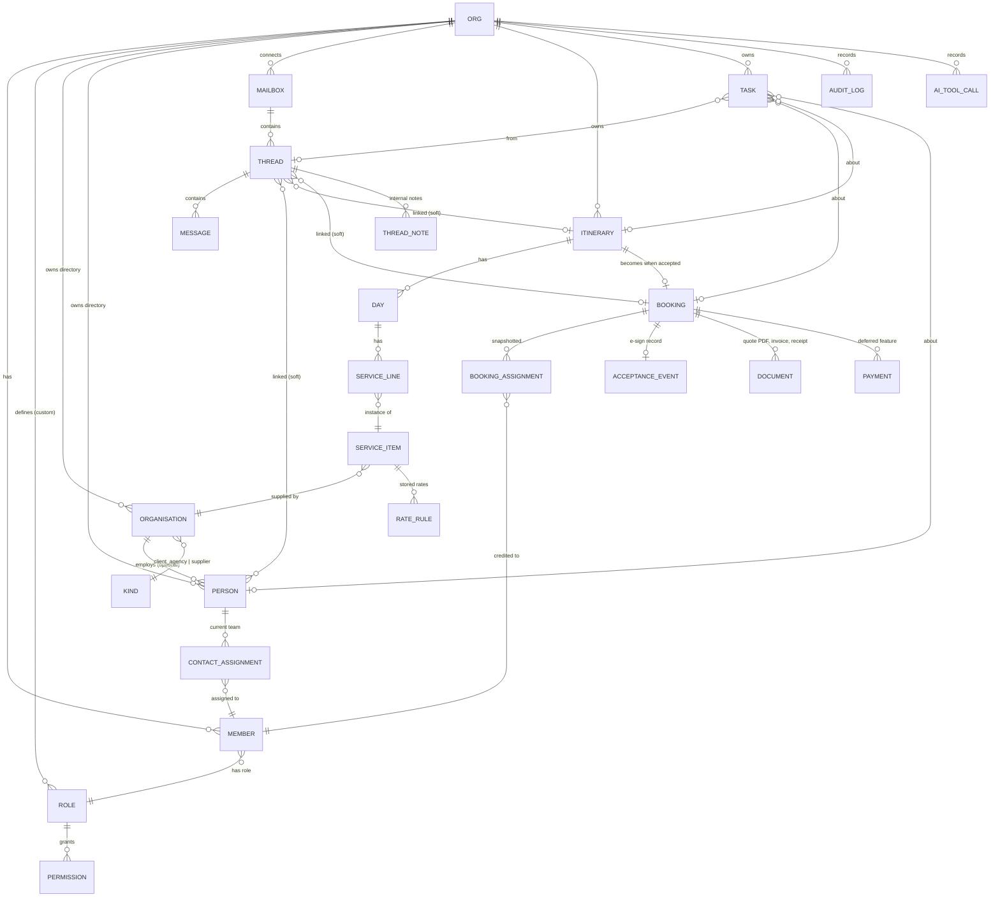
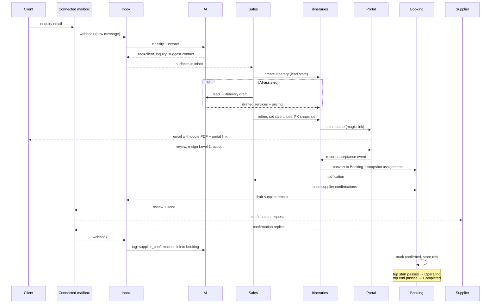

# System Spec — Part 5: Platform

> Series: [1. Foundations](./specs-part-1.md) · [2. Contacts, Pipeline, Pricing](./specs-part-2.md) · [3. Communication & AI](./specs-part-3.md) · [4. Operations & Surfaces](./specs-part-4.md) · **5. Platform** _(this file)_

The infrastructure and policy layer that everything else sits on. External integrations, the full entity model, the end-to-end workflow, subscription and payments, compliance and observability posture, non-goals, and where-to-find-what.

## External integrations

| Integration                           | Purpose                                                                                                                                                                     | Adapter?                                  |
| ------------------------------------- | --------------------------------------------------------------------------------------------------------------------------------------------------------------------------- | ----------------------------------------- |
| **Mailbox provider** (Nylas v1)       | Connect Gmail/Microsoft mailboxes; sync messages; send mail; receive webhooks for new messages.                                                                             | Yes — provider may change.                |
| **AI provider** (Anthropic Claude v1) | Inbox classification + drafting, itinerary chat (MCP tools), lead → itinerary generation, summarisation, translation, supplier suggestions.                                 | Yes — model/provider selection swappable. |
| **FX rate provider** (TBD)            | Daily exchange-rate fetches for FX snapshot at quote creation. Pluggable (Fixer / OpenExchangeRates / ECB / others).                                                        | Yes — small surface, easy swap.           |
| **Polar**                             | Subscription billing for the **DMC's account on this platform**. Not used for the DMC's own client/supplier payments.                                                       | Existing direct integration.              |
| **Resend**                            | Transactional outbound mail _from the platform itself_ — sign-in OTPs, notifications, system emails. **Not** used for client correspondence (that's the connected mailbox). | No.                                       |
| **Cloudflare R2**                     | Attachments, generated PDFs (quotes, invoices, receipts), uploaded files.                                                                                                   | No.                                       |
| **PostgreSQL**                        | System of record. Drizzle ORM.                                                                                                                                              | n/a                                       |
| **Redis**                             | Sessions, rate limiting, short-TTL caches.                                                                                                                                  | n/a                                       |
| **OpenTelemetry / Loki**              | Distributed traces and structured logs.                                                                                                                                     | n/a                                       |

The mailbox provider, AI provider, and FX provider get adapter interfaces (per [ADR-0003](../adr/0003-service-layer-pure-logic-thin-io.md)) because we expect to swap implementations. Resend / R2 / Polar are used directly because their replacement is unlikely.

### Operational payments — provider TBD

The DMC's operational payments (clients paying the DMC; the DMC paying suppliers) need their own provider, separate from Polar. **Provider choice is deferred** to the payments implementation. The payments feature will follow the same adapter pattern so the integration is swap-friendly.

## Entity model

The full logical schema, scoped per `org`. This is logical — not every column shown — to make relationships clear.

Notes:

- **Soft links** from threads to contacts / itineraries / bookings can be wrong (AI-extracted) or absent. Schema permits `null`.
- **`SERVICE_ITEM` / `RATE_RULE`** model the supplier catalogue with seasonal RRULEs and rate sources (`stored` / `dynamic` / `manual`).
- **`BOOKING_ASSIGNMENT`** is the snapshot of `CONTACT_ASSIGNMENT` at acceptance; it can be edited post-booking with audit logging.
- **`AI_TOOL_CALL`** is the tool-call audit log from [Part 3](./specs-part-3.md#tool-call-audit-log) — every AI mutation, queryable per entity.
- **`AUDIT_LOG`** is the general who/when/before→after trail used across all mutating operations.

## End-to-end workflow

The canonical happy path. Variations (modifications, cancellations, B2C self-service inquiries) follow the same backbone.

Operational payments and final-doc delivery slot in once the payments feature lands.

## Subscription

The DMC pays the platform. **Polar** handles the subscription billing.

- **Single paid plan** in v1, with a **trial period** (length TBD; typical 14–30 days).
- **No tier gating** in v1 — every paying org gets every feature, including branding and AI.
- Future tiering (e.g. seat counts, mailbox counts, AI cost cap, advanced features) can be introduced without rework: the system already exposes the entitlements (cost cap, role count, mailbox count) as configurable values.
- **Webhook lifecycle**: trial start, trial end, paid, payment failed, cancelled. Triggers in-app + email notifications to the org admin.

This is **distinct from operational payments**, which are out of scope for v1 (see below).

## Payments _(deferred)_

The DMC's operational money flow — the parts of the system that handle:

- **Inbound from clients** — invoicing (deposit + balance), receipt reconciliation, deposit collection from the client portal.
- **Outbound to suppliers** — supplier-payout scheduling, tracking, status.

Provider choice and detailed flow are deferred. Schema seeds in v1:

- Per-line P&L `paid` field reserved on service lines.
- `PAYMENT` entity reserved on bookings.
- `COMMISSION` / `CARD` / `WIRE` / `REFUND` / `CREDIT` payment types reserved in the type enum.

When the feature lands, it follows the same adapter pattern as mailbox/AI for the payment processor.

## Compliance & data

DMC customers are **global**. The platform is built GDPR-compliant by default regardless of where each customer is — easier than per-tenant variation.

### Data classes

| Class                    | Examples                                                              | Treatment                                                                                                            |
| ------------------------ | --------------------------------------------------------------------- | -------------------------------------------------------------------------------------------------------------------- |
| **Org-internal**         | Itineraries, bookings, rate sheets, internal notes, tasks, audit logs | Indefinite retention. Not user-readable cross-org.                                                                   |
| **Personal — contact**   | Contact name, email, phone, organisation, language preference         | Indefinite retention. Subject to GDPR access / erasure on request.                                                   |
| **Personal — sensitive** | Passport, DOB, dietary, mobility, allergies                           | Captured per trip. **Encrypted at rest.** Access logged. Retained as long as booking is active; reviewed on erasure. |
| **Email content**        | Mirrored inbound + outbound mail                                      | Indefinite retention. Sensitive — handled with the same care as personal contact data.                               |
| **Telemetry**            | Logs, traces                                                          | Retention per [ADR-0005](../adr/0005-observability.md). PII never put in log labels.                                 |

### Retention policy

**Indefinite by default** — this is a CRM. History is the product. Trip data lives forever so a client returning two years later still has a record.

GDPR rights are honoured separately:

- **Right to access** — admin export of all data tied to a person, on request, machine-readable (JSON).
- **Right to erasure** — manual flow run by an org admin. Personal fields are nulled / hashed; transactional records (bookings, invoices) are anonymised but retained for tax / audit purposes; audit log entries reference the erasure event.
- **Right to portability** — the access export above satisfies this.

No automatic time-based purge.

### Audit log

Every mutation on **contacts**, **itineraries**, **bookings**, **booking assignments**, **payments**, **mailbox connections**, **AI tool calls**, and **roles/permissions** writes an audit row. Captured fields: `at`, `byUserId` (or `system` / `ai`), `entityType`, `entityId`, `before`, `after`, `reason?`. Retained indefinitely.

Sensitive-data access (reading a person's passport / dietary fields) generates an access-log row, distinct from mutations, so an org admin can see "who looked at what."

### Hosting

- Hosting region picked at deployment time; can be moved without schema changes.
- No EU-only constraint baked in. If a customer requires it, that's a deployment-level decision, not a code change.
- All third-party providers used in v1 (Nylas, Anthropic, Polar, Resend, R2, Loki) offer GDPR-compliant data processing agreements.

## Observability

Per [ADR-0005](../adr/0005-observability.md):

- **Pino** for structured logs; **Loki** as the production sink.
- **OpenTelemetry** SDK for traces; OTLP-proto export.
- Every log line carries `requestId`, `userId`, `orgId`, `traceId`, `spanId`.
- All third-party calls (mailbox, AI, FX, Polar, Resend, R2) wrapped in spans with stable attribute namespaces.
- AI cost tracking attaches to spans on AI calls; usage rolls up per org.

Logs and traces are correlated end-to-end: jumping from a Loki entry to the matching trace is one click.

## Non-goals

Things this platform does not do, deliberately. Customers asking for these get an "integrate with the right tool for it" answer.

- **Property management system (PMS)** — we don't replace hotel front-desk software.
- **Global Distribution System (GDS)** — no Amadeus / Sabre / Travelport. Bookings go through suppliers the DMC contracts with directly.
- **Bookkeeping** — payment events flow out for accounting integrations; we don't replace QuickBooks / Xero.
- **Marketing automation** — no campaigns, drip sequences, lead scoring beyond the basic inbox tagging.
- **Online booking engine** — B2C direct-purchase flows (book without a quote) are not the priority. The platform is operations-first.
- **Bonus payout** — sales attribution is captured and reported; payout calculation is the org's payroll process, not ours.
- **Translation memory / TM-style language workflow** — the AI translates on demand; we don't run a separate localisation product.
- **Project management / sprints** — tasks are reminders, not Jira.

## Where to find what

| Looking for…                                                   | Go to                                                                 |
| -------------------------------------------------------------- | --------------------------------------------------------------------- |
| What the platform is, who uses it, the feature map             | [Part 1: Foundations](./specs-part-1.md)                              |
| Contact model (org + person), lead → quote → booking lifecycle | [Part 2: Contacts, Pipeline](./specs-part-2.md)                       |
| Pricing engine — line items, units, FX, RRULE, GIT             | [Part 2: Pricing engine](./specs-part-2.md#pricing-engine)            |
| Inbox features, threading, multi-mailbox                       | [Part 3: Inbox](./specs-part-3.md#inbox)                              |
| AI capabilities — tagging, drafting, MCP itinerary chat        | [Part 3: AI](./specs-part-3.md#ai)                                    |
| Sales attribution + reports                                    | [Part 4: Sales attribution](./specs-part-4.md#sales-attribution)      |
| Tasks, documents, client portal, e-sign, notifications         | [Part 4](./specs-part-4.md)                                           |
| Roles & permissions model                                      | [Part 4: Roles & permissions](./specs-part-4.md#roles--permissions)   |
| External integrations + adapters                               | [Part 5: External integrations](#external-integrations) _(this file)_ |
| Full entity diagram                                            | [Part 5: Entity model](#entity-model) _(this file)_                   |
| End-to-end workflow                                            | [Part 5: End-to-end workflow](#end-to-end-workflow) _(this file)_     |
| Subscription, compliance, observability                        | [Part 5](#subscription) _(this file)_                                 |
| Why we built it that way (technical decisions)                 | [ADRs](../README.md)                                                  |

## How to use this series

- **Onboarding a new contributor?** They read Part 1 first, then dip into the part that matches what they'll build.
- **Designing a new feature?** Place it on the feature map in [Part 1](./specs-part-1.md#feature-map). If it doesn't fit, the spec needs an update.
- **Changing how something works?** Update the relevant part in the same PR as the code. The spec series is allowed to drift no more than one release behind reality.
- **Found something missing or wrong?** Open a PR that fixes the spec; reviewers treat spec accuracy as part of code review.
