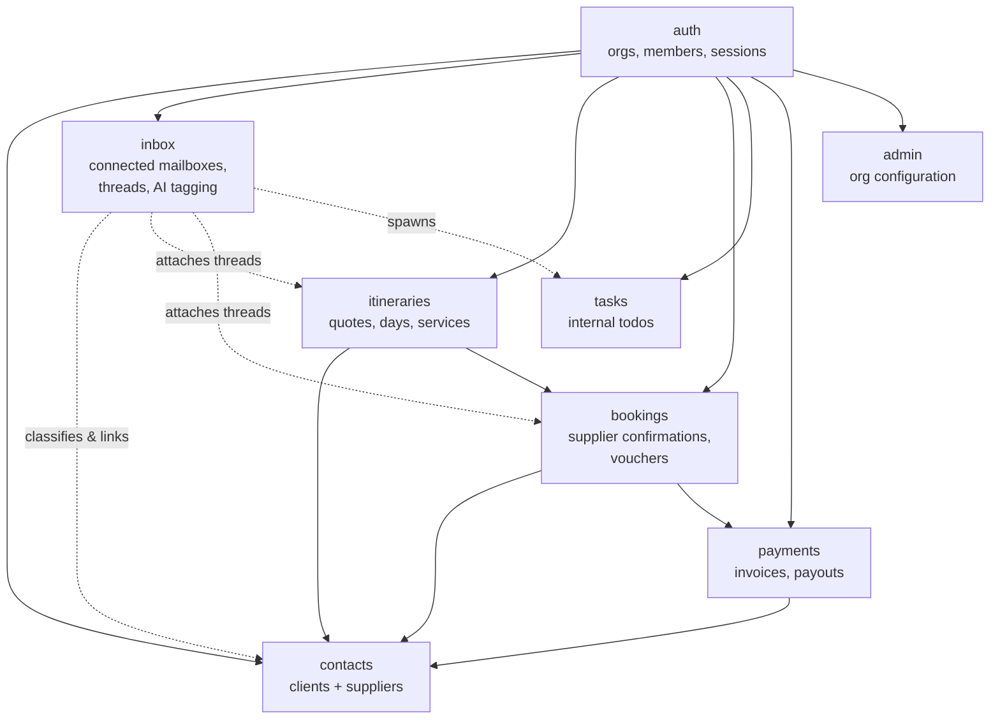
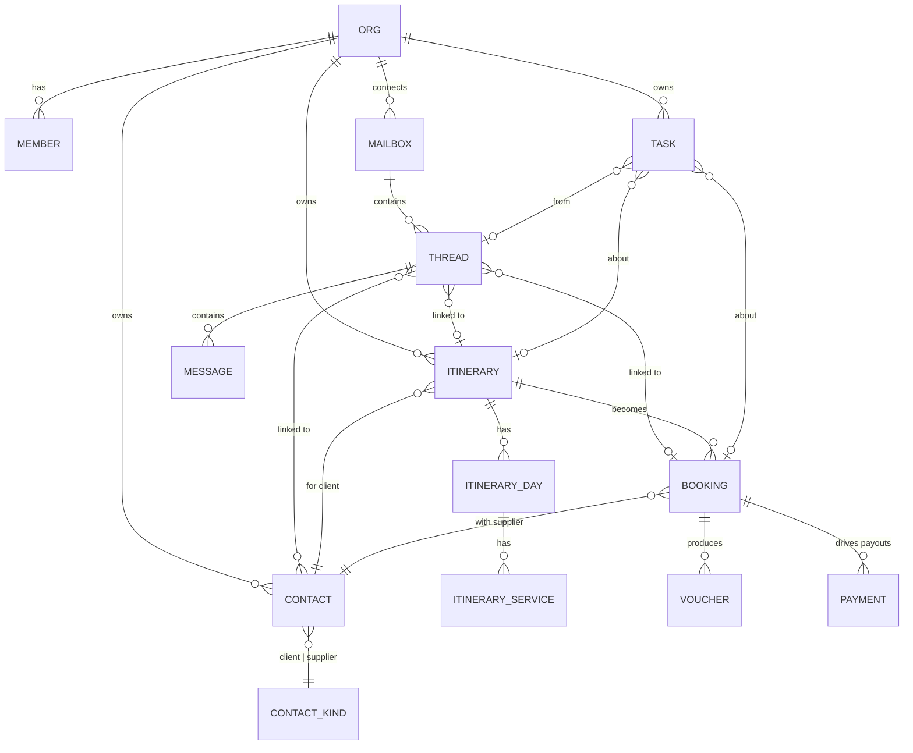
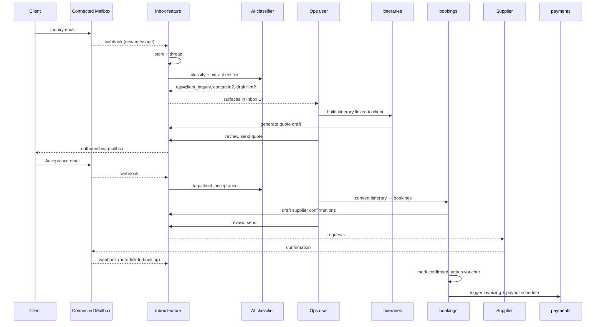

# System Overview

A SaaS platform for **Destination Management Companies (DMCs)** — local specialists who design, sell, and operate travel experiences in their destination on behalf of travel agents (B2B) or directly to travelers (B2C).

This document describes **what the system does** and **how the parts connect**. Implementation details live in per-feature plans; cross-cutting decisions live in [ADRs](./README.md).

## Domain glossary

| Term          | Meaning                                                                                                  |
| ------------- | -------------------------------------------------------------------------------------------------------- |
| **DMC**       | The customer of this platform — a company selling local travel services in a destination.                |
| **Org**       | A DMC's tenant in the system. Multi-tenant isolation boundary. All data is scoped per org.               |
| **Member**    | A user belonging to an org (ops, account manager, finance, admin).                                       |
| **Client**    | A travel agent (B2B) or a direct traveler (B2C) who buys from the DMC.                                   |
| **Supplier**  | A vendor the DMC books from: hotels, transport companies, guides, restaurants, activity providers.       |
| **Lead**      | An incoming inquiry from a potential or existing client, before it becomes a quote.                      |
| **Itinerary** | A multi-day plan of services offered to a client. The "product" the DMC sells. May go through revisions. |
| **Booking**   | A confirmed segment of an itinerary placed with a specific supplier (room nights, transfers, etc.).      |
| **Voucher**   | The document delivered to the supplier or client confirming a booking.                                   |
| **Mailbox**   | An email account (Gmail / Microsoft) connected to an org, e.g. `ops@dmc.com`.                            |
| **Thread**    | An email conversation, mirrored from the connected mailbox.                                              |

## Personas

- **Operations** — receives inbound email, builds itineraries, places bookings with suppliers, sends vouchers.
- **Account manager** — owns client relationships, especially repeat B2B agencies; handles modifications and follow-ups.
- **Finance** — issues invoices, reconciles client payments, schedules supplier payouts.
- **Admin** — org-level configuration, member management, billing.
- **Client (B2B agent)** — may eventually access a portal to view quotes and confirm.
- **Client (B2C traveler)** — receives quotes by email; lighter portal touch.

## Capabilities

What the system can do, grouped by area:

### Contact & relationship management

- Maintain a directory of **clients** (B2B agencies, B2C travelers) with contact details, preferences, history.
- Maintain a directory of **suppliers** with services, rate sheets, contract terms, contact people.
- Track interactions per contact (threads, itineraries, payments).

### Inquiry → quote → booking pipeline

- Capture **leads** from connected inboxes, web forms, or manual entry.
- Build **itineraries** by composing days × services × suppliers, with internal cost and quoted price.
- Send quotes to clients; track revisions.
- Convert accepted itineraries into **bookings** with suppliers; track confirmation status, references, vouchers.
- Manage modifications, cancellations, and rebookings without losing history.

### Communication

- Connect Gmail / Microsoft mailboxes per org (multiple per org supported).
- Mirror inbound and outbound mail into the system; thread by provider thread ID.
- AI-classify each message (client inquiry, supplier confirmation, payment, etc.) and best-effort link it to a contact, itinerary, or booking.
- Generate draft replies in context (thread + linked entities); humans accept, modify, or decline before send.
- Send replies through the same connected mailbox so the client sees normal email continuity.

### Task management

- Create internal **tasks** ("call hotel about late check-in", "chase missing passport copy") manually or auto-spawned from email tags.
- Assign to a member, set due date, link to itinerary/booking/contact.

### Payments _(scope deferred)_

- Inbound: invoice clients (deposit, balance), reconcile receipts.
- Outbound: schedule and track supplier payouts.
- Provider choice and detailed flow are decided at implementation time.

### Observability & operations

- Structured logs per request, correlated to OpenTelemetry traces.
- All third-party calls (Polar, Resend, mailbox provider, AI provider) traced as spans.
- Audit trail on key entities (itineraries, bookings, payments) — who changed what, when.

## Feature map

The system is organized as feature modules under `src/lib/features/`. Each feature owns its data model, business logic, and UI; cross-feature work goes through public APIs only (see [ADR-0002](./adr/0002-feature-based-architecture.md)).

**Dependency direction:** lower features (`auth`, `contacts`) don't know about higher ones. Higher features import from lower via public APIs. Inbox sits high because it consumes most of the graph.

## Core entities

**Tenancy:** every row is scoped to an `org_id`. Cross-org reads are prevented at the query layer.
**Soft links:** inbox threads link _optionally_ to contact/itinerary/booking — links can be wrong (AI-extracted) or absent (unlinked email) without breaking the schema.
**History:** itineraries and bookings carry version/revision metadata so quote history and booking changes are auditable.

## End-to-end workflow

The canonical happy path. Variations (cancellations, modifications, B2C direct booking) follow the same backbone.

## External integrations

| Integration                        | Purpose                                                                                         | Adapter?                                  |
| ---------------------------------- | ----------------------------------------------------------------------------------------------- | ----------------------------------------- |
| **Mailbox provider** (Nylas first) | Connect Gmail/Microsoft, sync messages, send mail, receive webhooks.                            | Yes — provider may change.                |
| **AI provider** (Anthropic Claude) | Tag inbound, extract entity links, generate draft replies.                                      | Yes — model/provider selection swappable. |
| **Polar**                          | Client-side billing for the DMC's subscription to the platform.                                 | Existing adapter.                         |
| **Resend**                         | Transactional outbound mail _from the platform itself_ (auth, notifications) — not client mail. | No.                                       |
| **Cloudflare R2**                  | Attachments, vouchers, generated PDFs.                                                          | No.                                       |
| **PostgreSQL**                     | System of record.                                                                               | n/a                                       |
| **Redis**                          | Sessions, rate limits, short-TTL caches.                                                        | n/a                                       |
| **OpenTelemetry / Loki**           | Tracing + structured logs.                                                                      | n/a                                       |

The mailbox and AI integrations get adapter interfaces (per [ADR-0003](./adr/0003-service-layer-pure-logic-thin-io.md)) because we expect to swap implementations. Resend/R2/Polar are used directly because their replacement is unlikely.

## Cross-cutting concerns

- **Multi-tenancy** — every read/write scoped by `org_id` enforced at the API layer; no row-level security at the DB.
- **Auth & permissions** — better-auth with org plugin. Roles: `admin`, `member` to start; finer roles (`finance`, `ops`) added when workflows demand.
- **Validation** — Zod schemas at feature root, shared client/server ([ADR-0007](./adr/0007-validation-zod-schemas.md)).
- **Error handling** — SvelteKit `error()` for HTTP-shaped failures, plain `throw` for bugs ([ADR-0006](./adr/0006-error-handling.md)).
- **Observability** — Pino + OpenTelemetry, request/trace correlation in every log line ([ADR-0005](./adr/0005-observability.md)).
- **Testing** — Playwright for user flows, Vitest for pure logic ([ADR-0008](./adr/0008-testing-strategy.md)).

## Non-goals

These are deliberately out of scope. If a customer asks, the answer is "integrate with a tool that does it":

- **Property management system (PMS)** — we don't replace hotel front-desk software.
- **Global Distribution System (GDS)** — we don't connect to Amadeus / Sabre / Travelport. Bookings go through suppliers we contract with directly.
- **Bookkeeping** — payment events flow out for accounting integration; we don't replace QuickBooks / Xero.
- **Marketing automation** — campaigns, drip sequences, lead scoring beyond simple tagging.
- **Online booking engine** — B2C direct-purchase flows are not the priority; the platform is operations-first.

## How to use this document

- **New contributor?** Read this top to bottom, then pick a feature folder and read its `index.ts`, `schemas.ts`, and `server/api/`.
- **Designing a new feature?** Place it on the feature map. If it doesn't fit, propose a map change in an ADR.
- **Adding a third-party integration?** Decide adapter-or-direct using the table above as precedent. New adapters need an ADR.
- **Things changed?** Update this document in the same PR. The overview is allowed to drift, but the gap should never be more than one release behind reality.
